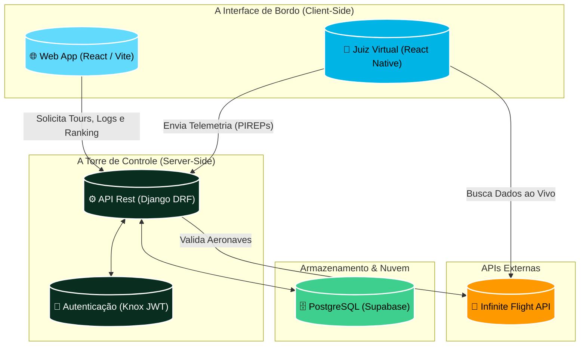

<div align="center">
  

  # 🌍 System Infinite World Tour
  **A experiência definitiva para pilotos virtuais do Infinite Flight**

  [](https://www.python.org/)
  [](https://www.djangoproject.com/)
  [](https://react.dev/)
  [](https://supabase.com/)
  [](https://worldtourinfinte.vercel.app/)

  ---

  ### 🛫 [Explore o Sistema Ao Vivo Aqui!](https://worldtourinfinte.vercel.app/) 🛬
  *Entre, cadastre-se e veja a magia acontecer.*
</div>

---

## 🚀 Sobre o Projeto

O **System Infinite World Tour** (anteriormente conhecido como Infinite Flight Crew Center) é uma plataforma de aviação virtual de ponta, projetada especificamente para revolucionar a forma como as *Virtual Airlines (VAs)* e pilotos operam dentro do **Infinite Flight**.

Nós unimos a paixão pela simulação de voo à engenharia de software avançada. Através de um *Tracker* no dispositivo mobile, capturamos a telemetria do piloto em tempo real, enviamos para uma API construída em **Django REST Framework** e exibimos os resultados num painel incrivelmente rico construído em **React**.

Se você gosta de aviação, desafios globais (como o épico World Cup Tour de 48 pernas) e rastreamento hiper-realista, você está no lugar certo!

---

## 🧠 Arquitetura do Sistema

O projeto é dividido em um ecossistema full-stack resiliente e escalável. Abaixo está o **Fluxograma de Arquitetura** que ilustra como cada parte do sistema conversa entre si:



---

## 🧩 O Sistema Parte a Parte

Para garantir escalabilidade, segurança e uma UI/UX impressionante, nós dividimos as responsabilidades tecnológicas:

### 1️⃣ A Interface de Bordo (Frontend)
Construído com **React** e impulsionado pelo **Vite** para máxima velocidade.
- **Material-UI (MUI)**: Fornece um design system limpo, responsivo e temático (Light/Dark mode) focado na aviação.
- **Painel Dinâmico**: Os pilotos têm acesso imediato ao seu Logbook, progresso nas pernas do Tour e estatísticas de voo.
- **Mapas Interativos**: Integração visual para despachos e rotas de voo.

### 2️⃣ A Torre de Controle (Backend)
Desenvolvido em **Python** usando **Django & Django REST Framework**.
- **Validação de Tours Lógica**: O sistema possui algoritmos inteligentes que checam aeroportos de partida, destino, companhias aéreas e a categoria de restrição das aeronaves para garantir que o piloto não trapaceie.
- **Gerenciador de Inatividade**: Rotinas automáticas gerenciam usuários inativos e em reserva, com tokens de reativação via e-mail.
- **Autenticação**: Sessões persistentes e seguras garantidas pela biblioteca JWT Knox.

### 3️⃣ O "Juiz Virtual" (Mobile App / Tracker)
Uma aplicação silenciosa (React Native) que roda no dispositivo do piloto em background enquanto ele voa no Infinite Flight.
- **Rastreamento de Telemetria**: Coleta em tempo real Força G no pouso, Desvio da Linha Central, Vertical Speed (VS) e muito mais.
- O Juiz Virtual é implacável! Ele pontua a estabilidade da sua aproximação e envia os *PIREPs* diretamente para o Backend.

### 4️⃣ O Banco de Dados na Nuvem (PostgreSQL)
- Tudo fica armazenado e protegido na poderosa infraestrutura do **Supabase**, garantindo que seus logs de voo nunca se percam na nuvem.

---

## ⚙️ Como Rodar Localmente (Desenvolvimento)

Quer contribuir ou dar uma olhada no código? Siga as instruções:

### 1. Backend (Django)
```bash
# Clone o repositório
git clone https://github.com/Dalmocabral/infinite-flight-crew-center.git
cd infinite-flight-crew-center/backend

# Crie e ative um ambiente virtual
python -m venv venv
# No Windows: .\venv\Scripts\activate
# No Mac/Linux: source venv/bin/activate

# Instale as dependências
pip install -r requirements.txt

# Faça as migrações (Criação das tabelas)
python manage.py migrate

# Inicie o servidor
python manage.py runserver
```

### 2. Frontend (React)
```bash
# Em um novo terminal, abra a pasta do frontend
cd infinite-flight-crew-center/frontend

# Instale os pacotes Node
npm install

# Suba a interface do usuário
npm run dev
```
*(O frontend geralmente roda em `http://localhost:5173`)*

---

## 🌟 Convite à Comunidade

Este projeto foi construído **de pilotos para pilotos**. Se você achou as soluções de engenharia interessantes, dê uma **Estrela (⭐)** no nosso repositório! 

Você está convidado a abrir _Issues_, sugerir melhorias na lógica do Tracker ou até submeter *Pull Requests* de novos Tours.

**Quer ver tudo isso em ação?**  
🔗 [Clique aqui e acesse o nosso painel oficial!](https://worldtourinfinte.vercel.app/)

---
<div align="center">
  <i>Desenvolvido com ☕, código e querosene de aviação. Bons voos!</i>
</div>
